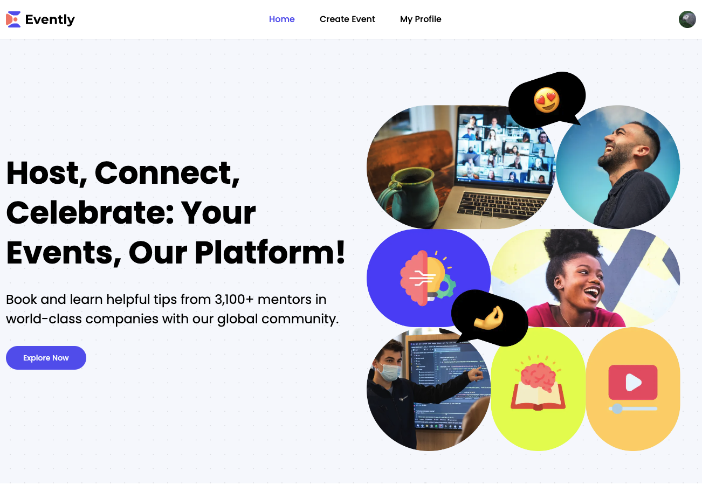

<h1 align='center'>Evently App | Events Platform</h1>

 

[Deploy by Vercel](https://evently-two-ruby.vercel.app/)

<h2>Проект представляющий собой платформу с мероприятиями</h2> 

<h3>Цель проекта:</h3>

+ Знакомство с Next 14 | Server Actions;
+ Clerk Auth + связь с MongoDB;
+ Имплементация Stripe + связь с MongoDB;
+ Shadcn components + TailwindCSS;
___

<h3>Реализованно:</h3>

+ CRUD функционал события;
+ Авторизация пользователя;
+ Роутинг, пагинация, поиск;
+ Данные хранятся в базе данных;
+ Адаптивный дизайн;
+ Организатор события имеет доступ к данным пользователей купивших билет;